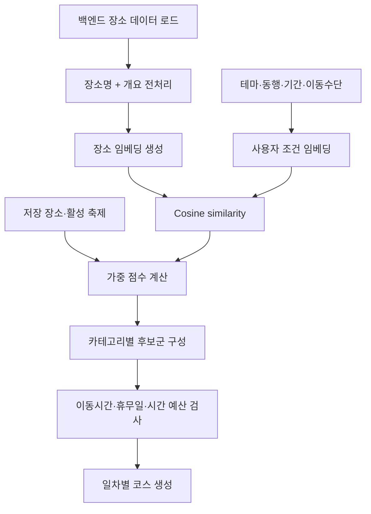

# OISO Course Recommendation

사용자의 여행 조건과 장소 콘텐츠를 의미 기반으로 비교하고, 저장 장소·축제·동행 유형·이동 효율·휴무일을 함께 반영해 경주 여행 일정을 만드는 추천 서비스입니다.

이 저장소는 추천 엔진과 이를 제공하는 FastAPI 애플리케이션을 포함합니다. 프론트엔드는 Spring Boot 백엔드에 요청하고, 백엔드가 이 서비스를 호출하는 구조를 기본으로 합니다.

## 핵심 특징

- `jhgan/ko-sroberta-multitask` 기반 한국어 문장 임베딩
- 테마와 동행 유형을 분리해 장소 설명과 cosine similarity 계산
- 저장한 장소와 여행 기간 중 진행되는 축제에 가점 부여
- 실제 경로 API의 이동시간을 반영하고 실패 시 거리 기반 규칙으로 대체
- 식당 휴무일과 날짜별 시간 예산을 고려한 일정 생성
- 교통 거점·관광지·숙소 ID 기반 출발지 지정
- 반나절부터 3박 4일까지 고정된 관광지/식당 배치 규칙 제공
- FastAPI, Pydantic 기반의 명확한 요청·응답 계약

## 추천 처리 흐름



## 임베딩과 점수

장소 임베딩 문장은 `장소명 + 장소 개요`로 구성합니다. 사용자 입력은 테마 문장과 동행 유형 문장을 각각 임베딩하고, 장소 임베딩과의 cosine similarity를 `0~1` 범위로 정규화합니다.

후보 선택 시 사용하는 최대 점수 구성은 다음과 같습니다.

| 요소 | 가중치 | 적용 방식 |
| --- | ---: | --- |
| 테마 유사도 | 0.50 | 정규화한 테마 cosine similarity |
| 저장 장소 | 0.20 | 해당 장소까지 이동시간이 30분 이하일 때 적용 |
| 동행 유형 유사도 | 0.10 | 정규화한 동행 cosine similarity |
| 여행 기간 내 축제 | 0.10 | 활성 축제 관광지에 적용 |
| 이동 효율 | 0.10 | `exp(-이동시간 / 30분)`으로 계산 |

```text
최종 점수 = 0.50 × 테마 유사도
          + 0.10 × 동행 유사도
          + 0.10 × 활성 축제 여부
          + 조건부 0.20 × 저장 장소 여부
          + 0.10 × 이동 효율
```

저장 장소와 활성 축제는 일반 상위 후보군 밖에 있더라도 우선 후보군에 다시 포함합니다. 호출 측에서 여행 기간과 축제 기간이 겹치는 장소를 계산해 `activeFestivalSpotIds`로 전달하며, 추천 엔진은 전달받은 축제만 활성 후보로 취급합니다.

## 일정 구성 규칙

하루 일정은 관광지와 식당을 번갈아 방문하도록 구성합니다.

| 여행 기간 | 일수 | 일차별 식당 수 | 총 추천 장소 수 |
| --- | ---: | --- | ---: |
| 반나절 | 1 | 1 | 3 |
| 당일치기 | 1 | 2 | 5 |
| 1박 2일 | 2 | 2, 1 | 8 |
| 2박 3일 | 3 | 2, 2, 1 | 13 |
| 3박 4일 | 4 | 2, 2, 2, 1 | 18 |

- 식당 1곳인 날: `관광지 → 식당 → 관광지`
- 식당 2곳인 날: `관광지 → 식당 → 관광지 → 식당 → 관광지`
- 일일 시간 예산은 8시간이며 반나절은 4시간입니다.
- 이동시간, 예상 체류시간, 남은 필수 장소와 복귀시간까지 예산 안에 들어오는 후보만 선택합니다.
- 같은 장소는 한 코스에서 중복 선택하지 않습니다.

## 출발지 규칙

요청에는 사용자의 실시간 좌표 대신 출발지 유형과 내부 장소 ID를 전달합니다.

| 유형 | 설명 |
| --- | --- |
| `PRESET` | 경주역, 경주시외버스터미널, 경주고속버스터미널 코드 |
| `TOUR_SPOT` | 백엔드 관광지 ID |
| `ACCOMMODATION` | 백엔드 숙소 ID |

- 교통 거점이나 관광지를 선택하면 전체 여행의 시작점으로 사용하고 마지막 날 해당 지점으로 돌아오는 시간까지 계산합니다.
- 숙소를 선택하면 매일 숙소에서 출발합니다.
- 출발지를 생략하면 추천 후보들의 중심 좌표를 시작점으로 사용합니다.

## 이동시간과 휴무일

`USE_ROUTE_API=true`이면 백엔드의 내부 경로 계산 API를 호출해 실제 이동 거리와 시간을 사용하고 결과를 메모리 캐시에 저장합니다. API 호출에 실패하거나 기능을 끄면 Haversine 직선거리와 다음 평균 속도로 이동시간을 추정합니다.

| 이동 수단 | 추정 속도 | 추가 규칙 |
| --- | ---: | --- |
| 도보 | 4 km/h | 없음 |
| 자전거 | 15 km/h | 없음 |
| 대중교통 | 30 km/h | 대기시간 10분 추가 |
| 자동차 | 50 km/h | 없음 |

식당 후보는 방문 예정일과 `restDate`가 명확히 겹치면 제외합니다. 현재 파서는 지정 날짜, 월·일, 매주 특정 요일, 매월 특정 주차의 요일 형식을 처리하며, 해석할 수 없는 문구는 영업 중인 것으로 간주합니다.

## API

FastAPI 실행 후 다음 문서를 사용할 수 있습니다.

- Swagger UI: `GET /docs`
- 상태 확인: `GET /health`
- 준비 상태: `GET /ready`
- 코스 추천: `POST /api/v1/recommendations/courses`

### 요청 예시

```json
{
  "travelTime": "ONE_DAY",
  "travelCompanion": "PARTNER",
  "preferredTravelTheme": "NATURE_SCENERY",
  "transportationMode": "CAR",
  "travelStartDate": "2026-09-20",
  "savedSpotIds": [101],
  "savedNearbyPlaceIds": [202],
  "activeFestivalSpotIds": [303],
  "departureCategory": "PRESET",
  "departurePlaceId": "GYEONGJU_STATION"
}
```

`departureCategory`와 `departurePlaceId`는 함께 전달하거나 함께 생략해야 합니다. `preferredTravelTheme`는 `null`일 수 있습니다.

### 주요 Enum

| 필드 | 값 |
| --- | --- |
| `travelTime` | `HALF_DAY`, `ONE_DAY`, `ONE_NIGHT_TWO_DAYS`, `TWO_NIGHTS_THREE_DAYS`, `THREE_NIGHTS_FOUR_DAYS` |
| `travelCompanion` | `ALONE`, `PARTNER`, `FRIENDS`, `FAMILY` |
| `preferredTravelTheme` | `HISTORY_CULTURE`, `NATURE_SCENERY`, `FOOD`, `null` |
| `transportationMode` | `WALK_PUBLIC_TRANSIT`, `BICYCLE`, `CAR` |
| `departureCategory` | `PRESET`, `TOUR_SPOT`, `ACCOMMODATION` |

### 응답 형태

```json
{
  "code": 2000,
  "message": "관광 코스 추천에 성공했습니다.",
  "data": {
    "concept": "추천 코스 콘셉트",
    "totalSpotCount": 5,
    "totalDurationMinute": 420,
    "items": [
      {
        "itemOrder": 1,
        "dayNumber": 1,
        "category": "TOUR_SPOT",
        "spotId": 101,
        "nearbyPlaceId": null,
        "name": "장소명",
        "latitude": 35.8,
        "longitude": 129.2,
        "distanceFromPreviousMeter": 1200,
        "durationFromPreviousSecond": 600,
        "visitDurationMinute": 60,
        "similarity": 0.87,
        "transportType": null
      }
    ]
  }
}
```

## 데이터 로딩

추천 엔진은 다음 두 방식 중 하나로 장소 데이터를 읽습니다.

1. `BACKEND_API_BASE_URL`의 `/api/v1/tour-spots`를 페이지 단위로 조회
2. `TOUR_DATA_PATH`로 지정한 CSV 파일 사용

좌표가 없는 장소는 추천 후보에서 제외합니다. 서버 시작 시 전체 장소의 임베딩을 생성하므로 첫 시작에는 모델 다운로드와 임베딩 생성 시간이 필요할 수 있습니다.

## 로컬 실행

### 1. 가상환경과 의존성

```bash
python -m venv .venv
```

Windows:

```powershell
.venv\Scripts\Activate.ps1
pip install -r requirements.txt
```

macOS/Linux:

```bash
source .venv/bin/activate
pip install -r requirements.txt
```

### 2. 환경변수

`.env.example`을 참고해 실행 환경에 설정합니다. 애플리케이션은 운영체제 환경변수를 직접 읽습니다.

| 변수 | 기본값 | 설명 |
| --- | --- | --- |
| `BACKEND_API_BASE_URL` | `https://oiso.duckdns.org` | 장소 및 경로 API를 제공하는 Spring 서버 |
| `MODEL_NAME` | `jhgan/ko-sroberta-multitask` | SentenceTransformer 모델 |
| `API_TIMEOUT` | `10` | 백엔드 요청 제한시간(초) |
| `API_PAGE_SIZE` | `100` | 장소 데이터 페이지 크기 |
| `USE_ROUTE_API` | `true` | 실제 경로 API 사용 여부 |
| `TOUR_DATA_PATH` | 없음 | API 대신 사용할 CSV 경로 |
| `BACKEND_AUTH_COOKIE` | 없음 | 인증이 필요한 백엔드용 선택적 Cookie 값 |
| `CORS_ALLOWED_ORIGINS` | 로컬·운영 FE | 쉼표로 구분한 허용 Origin |

### 3. API 서버 실행

```bash
uvicorn app.main:app --host 0.0.0.0 --port 8000 --reload
```

## 테스트

```bash
pip install -r requirements-test.txt
pytest -q
```

테스트 범위에는 API 계약, Enum 검증, CORS, 서비스 매핑, 일정별 장소 수, 관광지/식당 교대 규칙, 출발지·복귀 규칙, 휴무일 해석과 추천 가중치가 포함됩니다.

## Docker와 배포

```bash
docker build -t oiso-recommendation .
docker run --rm -p 8000:8000 --env-file .env oiso-recommendation
```

`main`에 push되면 GitHub Actions가 Docker 이미지를 빌드해 Docker Hub에 올리고, EC2의 Docker Compose 서비스가 새 이미지를 받아 재시작합니다. 배포에는 저장소 Secrets의 Docker Hub 및 EC2 접속 정보가 필요합니다.

## 프로젝트 구조

```text
modeling/
├─ app/
│  ├─ main.py           # FastAPI 앱과 엔드포인트
│  ├─ schemas.py        # 요청·응답 Pydantic 모델
│  ├─ service.py        # API 계약과 추천 엔진 어댑터
│  ├─ config.py         # 환경변수 설정
│  ├─ itinerary.py      # 일정 구성 규칙
│  ├─ availability.py   # 휴무일 해석
│  └─ route_contract.py # 백엔드 경로 API 계약
├─ recommender.py       # 임베딩, 점수 계산, 후보 선택
├─ tests/               # 단위·API 테스트
├─ docs/                # 백엔드 연동 문서
├─ Dockerfile
└─ requirements*.txt
```

## 현재 한계

- 매 요청마다 동적으로 최적화하는 전역 최단경로가 아니라 점수와 이동시간을 함께 보는 greedy 방식입니다.
- 경로 API 장애 시 직선거리 기반 추정치가 사용됩니다.
- 자유 형식 휴무일 문구 중 명시적으로 지원하지 않는 표현은 제외 판단에 사용하지 않습니다.
- 장소 데이터가 바뀌면 현재 구현에서는 추천 서버를 다시 시작해야 임베딩에 반영됩니다.
